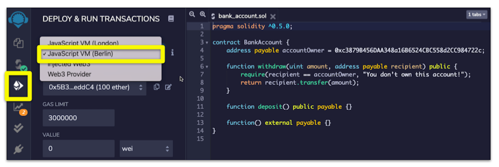
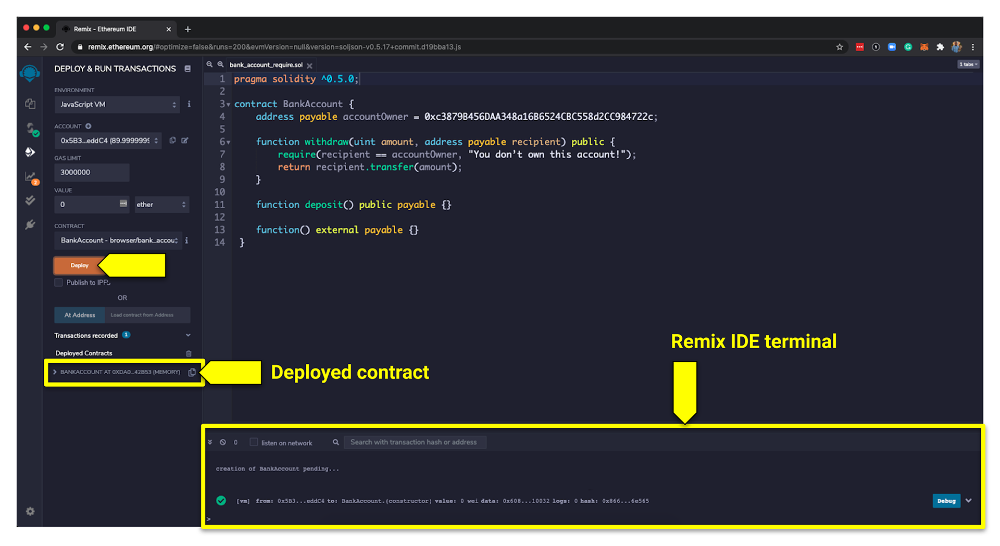
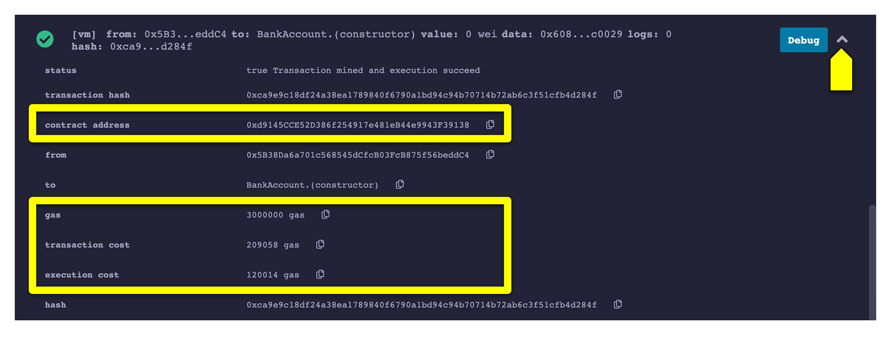
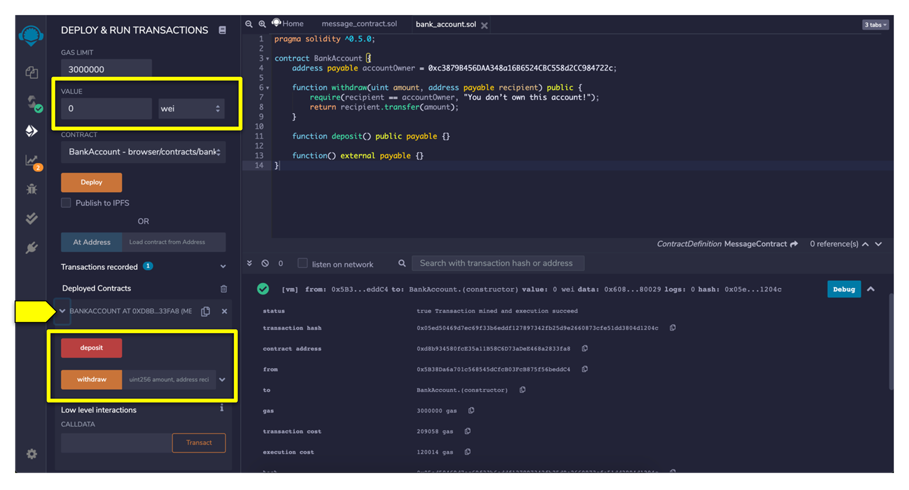
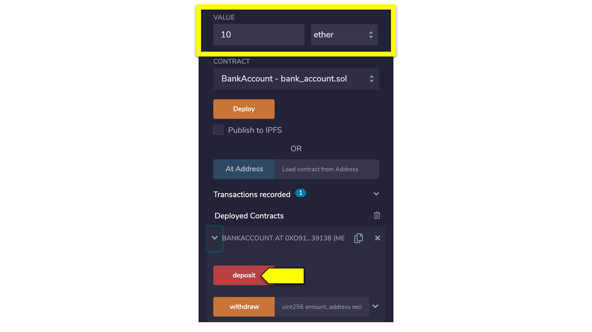
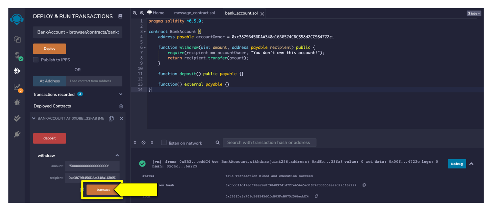

## 20.3 Lesson Plan: Solidity Continued

### Overview

In this lesson, students will learn how to deploy contracts using the JavaScript VM. They will also learn how to build functions to send ether and to use the `msg` object in Solidity. These are the last skills they need to learn in order to build fully deployable and functional smart contracts.

### Class Objectives

By the end of this class, students will be able to:

* Summarize the requirements needed to deploy a smart contract by using the JavaScript VM.

* Identify the five steps for creating a deployable smart contract.

* Use the Remix IDE to deploy and run transactions.

* Develop a smart contract containing a function to send ether.

* Provide an example of when to use the Solidity `msg` object.

* Test the JavaScript VM in Solidity using functions to withdraw and deposit ether.

* Discuss the history of real-world blockchain applications.

### Instructor Notes

* Today’s lesson should be exciting for students now that they have some experience building smart contracts with Solidity. In this class, they are going to learn the final steps of building and deploying smart contracts in the Ethereum blockchain.

* Expect that some students may be anxious about learning a new programming language in a short period of time, especially one that differs so much from Python. Reassure students that, with enough practice, they’ll be able to read and write Solidity with ease. 

* This lesson introduces new programming concepts specific to the Solidity language. These concepts involve communicating with others via smart contracts and deployment.

* If you are new to Solidity, we recommend reviewing the [Instructor Support documents](../Instructor_Support/Solidity.md) in preparation for this class.

* Remember to set your Remix compiler version to match your pragma. Otherwise, unexpected errors may occur.  The pragma and compiler version should match, as seen in the following image:

    

* **Important:** Pragma requirements are constantly changing. You may come across files that fail to compile due to pragma updates. If so, the error message in Remix will indicate what pragma and compiler version are necessary to resolve the error.

* One of the most common errors is the `Gas estimation failure` error. It can be frustrating to encounter, as it serves as a kind of "catch-all" error, delivering a vague message that offers little guidance on what actually caused it. In these instances, check the [Troubleshooting Gas Estimation Errors](../Supplemental/StudentGuide.md#troubleshooting-gas-estimation-errors) section of the [Student Guide](../Supplemental/StudentGuide.md) for helpful tips.

* In the Remix IDE, the functions you observe in the smart contract may have buttons of different colors.

  * Constant, or “pure”, functions in Solidity have blue buttons. Clicking this type of button does not create a new transaction; it will only return a value stored in the contract and won’t cost you anything in gas fees.

  * Functions that change the state of the contract and do not accept ether are called **non-payable functions** and have orange buttons. Clicking these will create a transaction and thus cost you gas.

  * **Payable functions** in Solidity have red buttons. Clicking a red button will create a new transaction that can accept a value. The value is entered in the Value field, which is under the Gas Limit field.

* For more information about running and deploying functions, review the [Remix documentation](https://remix-ide.readthedocs.io/en/latest/udapp.html).

### Slideshow and Time Tracker

* The slides for this lesson can be viewed on Google Drive here: [Lesson 20.3 Slides](https://docs.google.com/presentation/d/1C52kRGg2kq_okkIX39Lkv3CSzV5wSIuxMue4imuQVw4/edit?usp=sharing).

* To add the slides to the student-facing repository, download the slides as a PDF by navigating to File, selecting "Download as," and then choosing "PDF document." Then, add the PDF file to your class repository along with other necessary files. You can view instructions for this [here](https://docs.google.com/document/d/1XM90c4s9XjwZHjdUlwEMcv2iXcO_yRGx5p2iLZ3BGNI/edit?usp=sharing).

* **Note:** Editing access is not available for this document. If you wish to modify the slides, create a copy by navigating to File and selecting "Make a copy...".

* The time tracker for this lesson can be found here: [Time Tracker](TimeTracker.xlsx).

---

### 1. Instructor Do: Welcome Class (10 min)

In this section, you’ll welcome students to the final class of this unit and introduce today’s lesson content.

First, recap what students have learned so far and explain what they will learn today.

* So far, you have written smart contracts with functions, used getters and setters, learned about memory and gas-fee structure, and explored variable types in Solidity.

* You have also learned how to write code in Solidity and create smart contracts using the Remix IDE.

* Today, you will learn the final step of creating a working smart contract: deploying a smart contract by using the Javascript VM and the Remix IDE.

Indicate that the class has not yet deployed any contracts they have written to the Ethereum blockchain.

* There are two ways in which contracts can be deployed:

  1. In an operating Ethereum blockchain network.

  2. In a **sandboxed** blockchain network.

Define a **sandbox** in programming: an isolated development environment.

* This particular environment exists on a network and mimics the end-user operating environment.

* With a sandbox, programmers can develop and test new code in a low-risk environment that’s identical to the production environment. In this case, the sandboxed environment mimics a live node that’s running the EVM.

Highlight to students that in this lesson, they’ll learn about the requirements for deploying and running their smart contracts, and then observe the smart contracts in action.

* The goal of this lesson is to deploy and test your contracts by using the Remix IDE and a sandboxed EVM.

* This should prove helpful, because you can test your contracts in a controlled environment without spending real ether.

Connect this lesson and what students have learned so far to the homework assignment:

* In this week’s homework assignment, you’ll complete the entire lifecycle of a smart contract&mdash;from coding and compiling to successfully deploying on the EVM that the Remix IDE provides.

---

### 2. Instructor Do: Deploying a Smart Contract in Ethereum: Requirements (15 min)

**Corresponding Activity:** [Bank Account Contract to Deploy](Activities/01-Ins_Bank_Account)

In this section, you'll review the steps you need to take before deploying a smart contract on the Ethereum blockchain.

**File:** [Bank Account Contract to Deploy](Activities/01-Ins_Bank_Account/Solved/bank_account.sol)

Tell students that we’re about to discuss the requirements for running a smart contract in the Ethereum blockchain. It’s crucial to understand the requirements for deployment.

#### Requirement 1: Have a Compiled Smart Contract

The first requirement is to have a compiled smart contract.

* Remember, a compiled smart contract can still be vulnerable to attack by bad actors.

* When writing Solidity code, business logic errors might exist due to incorrect code implementation. Having a successfully compiled contract ensures that the EVM can run it, and that we can use it in any Ethereum-based network.

Compile the bank account contract in Remix before moving on to Requirement 2.

Remind the class that, at this point in the unit, they have already compiled several smart contracts. So, they can check this off the list of requirements.

#### Requirement 2: Choose an Execution Environment

The second requirement for deploying a smart contract is to choose an execution environment.

* An **execution environment** is a valid blockchain network where the contract will reside and run.

* The Remix IDE offers the following execution environments:

  * **JavaScript VM:** This sandboxed blockchain is implemented in JavaScript. It runs in the browser to emulate a real Ethereum blockchain. This environment has no associated costs. It’s intended for testing smart contracts in a sandboxed environment before deploying them into a real blockchain. This is the environment we’ll use to deploy our smart contracts in this lesson.

  * **Injected Web3:** From this environment, we can deploy our smart contracts in private or public Ethereum networks by using external tools, such as MetaMask or Mist. We’ll cover these tools in later units.

  * **Web3 provider:** From this environment, we can deploy our smart contracts directly in any private or public Ethereum network. We do so by using a remote node of the network&mdash;without any external tool in the middle. We just need to provide the URL address of the provider that we want.

Remind students that in the previous unit, they used the Web3 provider that’s built into the Web3 Python library as an Ethereum tester. Later, we’ll use the full Web3 provider environment and other blockchain development tools to create a blockchain web application.

#### Requirement 3: Identify the Amount of Gas that You Need

The next few talking points explain the final requirement for deploying smart contracts, which is identifying the cost of the contract:

* The final requirement for deploying a smart contract involves the payment that we make to the network where we’ll deploy it.

* Every time that we deploy a smart contract, we need to have ether available to pay for the gas that’s required to deploy and run the smart contract.

* Because we’ll use the JavaScript VM in this lesson, we won’t incur any costs. However, we need to learn how to identify the appropriate amount of gas by analyzing the execution log of the contract. The **execution log** can be compared to the flight logbook of an aircraft.

* The execution log records all the activity that relates to the contract. We can thus confirm the operations status of the contract and observe the gas expense for each operation that the smart contract made.

Highlight that as a fintech professional, it’s important to know that deploying a smart contract requires more gas than what a simple ether transfer pays.

* The amount of gas depends on the complexity of the contract and the optimization of the created code. Developing optimal code for contracts is partly an art and comes partly from experience. It’s even a research matter nowadays.

* Slack out the [research paper “Under-Optimized Smart Contracts Devour Your Money”](https://arxiv.org/pdf/1703.03994.pdf) and the [presentation from DappCon](https://youtu.be/qwBkeJ84d2g). Let students know that these are both good sources for learning about gas optimization. Also explain that DappConn is a nonprofit conference organized by the Ethereum community.

Point out that the three requirements for deploying a smart contract aren’t complex. Most of the complexity involves understanding the business needs and then writing the contract. Once we successfully compile a smart contract and choose an execution environment, we can deploy the contract in seconds.

Pose the following question to the class:

* **Question:** Let’s say that we want to provide a checklist to assist newcomers with Solidity programming. Specifically, we want to describe the steps that they should take to create and deploy a smart contract. What will this list consist of?

* **Answer:** Taking into account all the skills that we've learned so far, the checklist might be the following:

  1. Define the business scenario where we want to use a smart contract.

  2. Architect the functionality of the smart contract, and define the functions.

  3. Create the code that implements the solution that we want to build.

  4. Compile the smart contract in the Remix IDE. If any errors occur, fix them.

  5. Deploy the smart contract in the Ethereum network.

* Point out that Items 1&ndash;3 are generic. That is, we use them to create a software application in Python or in Solidity.

---

### 3. Instructor Do: Deploy and Run a Smart Contract in the JavaScript VM (30 min)

**Corresponding Activity:** [Compiled Bank Account](Activities/01-Ins_Bank_Account)

In this section, you’ll demonstrate how to deploy and run a smart contract in the JavaScript VM.

Open an instance of Remix. Explain each part of the code as you demonstrate it for the students.

Explain to students that we’ll deploy our smart contracts for testing purposes in the JavaScript VM offered by the Remix IDE.

**File:** [Compiled Bank Account](Activities/01-Ins_Bank_Account/Solved/bank_account.sol)

#### Deploy a Smart Contract in the JavaScript VM

Open the compiled `BankAccount` smart contract. The following image details our previous compilation. (The green checkmark indicates a successful compilation.)


Explain that the next step is to choose our execution environment.

* In the sidebar, click the “Deploy & run transactions” button to display the “Deploy & Run Transactions” pane.

* The “Deploy & Run Transactions” pane makes several configuration options available, which you’ll learn about in later units. 

* There are two Javascript VM versions available - Berlin and London. The Berlin version of the chain uses the same protocols as the Ethereum mainnet, so we'll be using this option. Verify that "JavaScript VM (Berlin)" is selected in the Environment drop-down list, as the following image shows:

  

* Click the Deploy button to deploy our smart contract. After a successful deployment, our deployed contract appears in the “Deploy & Run Transactions” pane, as the following image shows:

  

Remind the class that in earlier lessons, every smart contract has an Ethereum address.

* Infer that the execution environment assigns this address the contract when it successfully deploys it. Additionally, a separate pane that contains the Remix IDE terminal displays a message indicating that the contract was deployed. This terminal works as a command-line interface, where commands are run and tracked and both the transactions and operations are made in the blockchain network.

* Furthermore, if we click the arrow button that’s next to the Debug button, this terminal will display a detailed description of the transaction. For example, the address assigned to the contract and the amount of consumed gas both display. Use this information to keep track of the operations that our contracts run. The following image shows this information in the Remix IDE terminal:

  

Explain that our smart contract is now deployed in the sandboxed Ethereum blockchain! It’s live and ready for use.

The next section discusses how to run the functions in the contract.

* Since the smart contract is deployed, we can start using its functions by using the Remix IDE.

* Click the arrow that’s next to the deployed contract to display the functions that can be called. These functions are the ones that are publicly callable from the contract, as the following image shows:

  

* For the contract, the `withdraw` function has an input box. This box can be used to set the function arguments.

* Notice that the `deposit` function doesn’t have an input box. This is because it doesn’t have any arguments. Instead, use the Value box, which is further up in the pane, to specify an amount of ether. The first check on testing the contract would be to run the `deposit` function.

Tell students that for this example, we'll start running our contract by depositing 10 ether into the contract.

* In the Value box, type 10, and then select the denomination that we want to use for the transaction. In this case, we select “ether” from the Value drop-down list. Then click the “deposit” button, as the following image shows:

  

* The Remix ID terminal displays the details of the transaction that the network recorded after running the `deposit` function.

* Two important details are the transaction status and the transaction value, as the following image shows:

  

* In this case, we can use the status to verify that the transaction successfully ran and that the value is ten quintillion wei.

Pose the following question:

* **Question:** If we deposited 10 ether, why was the value set to ten quintillion wei?

  * **Answer:** When we move ether in a blockchain network, we usually work with the smallest denomination of ether, which is wei.  Recall that 1 ether is equivalent to 1 &times; 10 to the 18th power. (That number is 1 followed by 18 zeros.) In our case, 10 ether is ten quintillion wei. (That number is 1 followed by 19 zeros.) Remembering how to convert ether to wei and vice versa can be challenging! So, we can use a website like [Ethereum Unit Converter](https://eth-converter.com/) to ease doing the conversion.

#### Run the withdraw Function

In this section, you’ll demonstrate running the `withdraw` function. You will withdraw 10 ether from the smart contract by using `withdraw`.

Begin the demonstration by covering the following talking points.

* The `withdraw` function requires that we specify the amount to withdraw in wei, the smallest  denomination of ether.

* To set the values for the arguments, click the arrow next to the `withdraw` function. Note that we can set values for the `amount` and `recipient` arguments.

* For the `amount` argument, specify 5 ether, which is equivalent to 5,000,000,000,000,000,000 wei. Because Remix can't parse numbers with commas, simply copy the value from this text: 5000000000000000000.) For the `recipient` argument, we need to specify the owner address that the contract specifies.

* To run the `withdraw` function, we click the “transact” button, as the following image shows:

  

Congratulate the students. They now know how to write, compile, deploy, and run a smart contract. Answer any questions before moving on to the activity.

---

### 4. Student Do: Sending Remittances via Smart Contracts (30 min)

**Corresponding Activity:** [Sending Remittances via Smart Contracts files](Activities/02-Stu_Sending_Remittances)

In this activity, students will deploy and run the `CustomerAccount` contract that they created during the previous lesson to send remittances by using smart contracts.

Tell students to use the Solidity file in the `Unsolved` folder to test this contract.

**File:** [Sending Remittances via Smart Contracts files](Activities/02-Stu_Sending_Remittances/Unsolved/customer_account.sol)

**Instructions:** [README.md](Activities/02-Stu_Sending_Remittances/README.md)

---

### 5. Instructor Do: Review Sending Remittances via Smart Contracts (15 min)

**Corresponding Activity:** [Sending Remittances via Smart Contracts files](Activities/02-Stu_Sending_Remittances)

In this activity, instructors will run a smart contract in the Remix IDE to review the previous activity.

**File:** [Sending Remittances via Smart Contracts files](Activities/02-Stu_Sending_Remittances/Solved/customer_account.sol)

Navigate to the “Deploy & Run Transactions” pane, and then deploy your contract. Talk about the code and address student questions as you run the functions for this demonstration.

Address, that the code below labels the compiler verison, declares the contract, and the state variables which are listed below the contract declaration.

  ```solidity
  pragma solidity ^0.5.0;

  contract CustomerAccount {
      address payable owner;
      bool isNewAccount;
      uint public accountBalance;
      string customerName;
      string customerLastName;
      address payable authorizedRecipient;
  ```

Run the `getInfo` function, and point out that the output that is currently nothing because the variables are not yet stated.

* Explain that this function is view only to save gas because we are only looking at the variables. 

* Then, point out that the types returned need to be stated when declaring the function after the keyword `returns`.

* Finally, the function will return the values for owner, authorizedRecipient, isNewAccount, accountBalance, customerName, and customerLastName.

  ```solidity
      function getInfo() view public returns(address, address payable, bool, uint, string memory, string memory) {
          return (owner, authorizedRecipient, isNewAccount, accountBalance, customerName, customerLastName);
      }
  ```

Move on to the `setInfo` function, point out that this function will fulfill the required customer information in the contract. 

* The `setInfo` function below is a setter function. This function will declare the new values varliables that we list when declaring this function. 

For this demo, set the `owner` address and the `authorizedRecipient` address to an etherum address, `isNewAccount` to true or false, the initial account balance of zero, and give the `customer` a first and last name.

* Explain that the code below is giving the variables all new values.


  ```solidity
      function setInfo(address payable newOwner, address payable newAuthorizedRecipient, bool newAccountStatus, uint newAccountBalance, string memory           
        newCustomerName, string memory newCustomerLastName) public {
          owner = newOwner;
          authorizedRecipient = newAuthorizedRecipient;
          isNewAccount = newAccountStatus;
          accountBalance = newAccountBalance;
          customerName = newCustomerName;
          customerLastName = newCustomerLastName;
      }
  ```

Run the `getInfo` function, and point out that the values have changed.

* Then explain that the `sendRemittance` function is taking in an amount as an unsigned integer and a payable address.

* The `require` function is ensuring that the person reciving the ether is either the `owner` an `authorizedRecipient` which is declared in our setter function.

* Then the amount is transfer with `.transfer` to the `recipient` wallet.

* Finally, we change the account `accountBalance` to the balance of the contract `address(this).balance`.


  ```solidity
      function sendRemittance(uint amount, address payable recipient) public {
          require(recipient == owner || recipient == authorizedRecipient, "The recipient address is not authorized!");
          recipient.transfer(amount);
          accountBalance = address(this).balance;
      }
  ```
  
  ```solidity
      function deposit() public payable {
          accountBalance = address(this).balance;
      }

      function() external payable {}
  }
  ```

Review what happens when `20 ether` is added to the contract by adding it and running the `getInfo` function.

Highlight what you just demoed by explaining the changes in the output: the `deposit` function has moved the ether to the recipient’s wallet. Remind the class how it has changed throughout the activity as you have added and subtracted ether.

Ask if the class has any additional questions before moving on.

---

### 6. Instructor Do: The Solidity msg Object (15 min)

**Corresponding Activity:** [The Solidity msg Object](Activities/03-Ins_Msg_Object/Solved/msg_test.sol)

In this activity, students will learn about the `msg` Solidity object and its attributes. It’s important to explain each way the `msg` attribute can be used and answer any questions.

Slack out the link to the cheat sheet and then open `msg_test.sol` in the Remix IDE.

**Files:**

* [The `msg` Object Attributes Cheat Sheet](Activities/03-Ins_Msg_Object/Resources/msg-cheatsheet.md)

* [msg_test.sol](Activities/03-Ins_Msg_Object/Solved/msg_test.sol)

Explain that every time a smart contract is executed in the Ethereum Virtual Machine (EVM), objects are created that are considered global variables. One of these objects is the `msg` (stands for “message”) object that exposes some useful attributes that can be used in a smart contract.

Begin to share your screen. Open the cheat sheet and highlight the following:

* The `msg` object represents the transaction call (originated by an Ethereum address) or the message call (originated by a contract's address) that triggers a contract execution.

* This object contains special attributes that allow access to the blockchain.

* The attributes of the `msg` object are the following:

  * `msg.sender`: Represents the Ethereum address that initiated the contract call. It can be an Ethereum address or a contract's address.

  * `msg.value`: Represents the value of ether that is sent in the transaction (expressed in wei).

  * `msg.data`: Represents the data payload of the call into our contract (expressed in bytes).

  * `msg.sig`: Represents the first four bytes of the data payload.

Slack out to students [this page from the Solidity documentation](https://docs.soliditylang.org/en/v0.5.0/units-and-global-variables.html#block-and-transaction-properties) for further reference.

Next, open the Remix IDE to show a simple demo of the `msg` object. Import the provided `msg_test.sol` contract into Remix and highlight the following:

* This is a simple demo contract to show you how the `msg` object works.

  ```solidity
    pragma solidity ^0.5.0;

    contract MsgTest {
        uint public balance = 0;
        address public msgSender;
        uint public msgValue;
        
        function deposit() public payable {
            balance = address(this).balance;
            msgSender = msg.sender;
            msgValue = msg.value;
        }
    }
  ```

* Note that this contract only has a `deposit` function, where the `msg.sender` and `msg.value` attributes are assigned to two different public variables.

Pose the following question to the class:

* **Question:** Suppose that we compile and deploy this contract. Next, we deposit 5 ether. What will be the value of the `msgSender` and `msgValue` public variables?

If no students answer, provide this explanation:

* **Answer:** Since the contract was the entity that triggers the deposit transaction, the `msgAddress` will contain the contract's address, and the `msgValue` will have a value of 5 ether expressed in wei.

Continue the demo. Show students how to do the following:

* Compile and deploy  the contract to the JavaScript VM provided by the Remix IDE.

* Test the `deposit` function by adding 5 ether to the contract.

* Fetch the value of all the public variables.

Answer any questions before sending the students on break.

---

### 7.  Break (15 min)

---

### 8. Student Do: Personal Savings Smart Contract (30 min)

**Corresponding Activity:** [Personal Savings Smart Contract](Activities/04-Stu_Deploying_Contract)

In this activity, students will extend the functionality of the personal savings smart contract. . After coding the updates requested, students will compile the contract. Then, they will deploy and test the contract's functions in the Remix IDE local blockchain.

**Files:**

* [Instructions](Activities/04-Stu_Deploying_Contract/README.md)

* [PersonalSavings.sol](Activities/04-Stu_Deploying_Contract/Unsolved/PersonalSavings.sol)

---

### 9. Instructor Do: Review Personal Savings Smart Contract (10 min)

**Corresponding Activity:** [Personal Savings Smart Contract](Activities/04-Stu_Deploying_Contract)

In this section, you’ll review the activity that students just completed, in which they extended the functionality of the personal savings smart contract. 

Open the `Personal Savings Contract` in the Remix IDE and review each step.

**File:**

* [PersonalSavings.sol](Activities/04-Stu_Deploying_Contract/Solved/PersonalSavings.sol)

Modify the `PersonalSavings` contract to initialize the following variables:

* A public unsigned integer variable `balance`.

* An address variable `last_to_withdraw`.

* An unsigned integer variable `last_withdraw_amount`.

* An address variable `last_to_deposit`.

* An unsigned integer variable `last_deposit_amount`.

  ```solidity
  contract PersonalSavings {
      address payable public public_savings = 0x77B2aD074a1aF1AF2a408E3D48465E5F9ec75f45;
      address payable private_savings = 0x873Ad450656C46cb564eaf418472A1c77d7327Ad;
      string account_holder = "Jane Doe";
      uint public balance;

      address last_to_withdraw;
      uint last_withdraw_amount;

      address last_to_deposit;
      uint last_deposit_amount;
  ```

Modify the `withdraw` function in the `PersonalSavings` contract by replacing the `if` statement for two `require` function calls as follows:

* The first `require` function call checks if the recipient address is the public or private savings address. If the function returns false, the error message `This is not your account` will be displayed.

* Set the parameters for `require` to check if the recipient is the owner of the public or private savings account. If the recipient is not the owner, the code should return a string informing the recipient `“This is not your account”`.

* The second `require` function call should check if there is enough ether in the contract balance to commit the withdrawal operation. If the function returns false, the error message `You don't have enough funds!` will be displayed.

* Require the balance in the corresponding address to be greater than or equal to the amount `require(address(this).balance >= amount`, or we will let the user know with a string response, `"You don't have enough funds!"`.

* These steps ensure that the account user is the sender, and that there is enough ether for the transaction.

   ```solidity
    function withdraw(uint amount, address payable recipient) public {
       require(recipient == public_savings || recipient == private_savings, "This is not your account");
       require(address(this).balance >= amount, "You don't have enough funds!");
    ```

* Use an `if` statement to check if the `last_to_withdraw` is NOT equal to `recipient`. If it isn't, set `last_to_withdraw` equal to `recipient`.

* This is similar to conditionals that the students have created previously.

    ```solidity
    if (last_to_withdraw != recipient) {
      last_to_withdraw = recipient;
    }
   ```

* Set `last_withdraw_amount` equal to the `amount` parameter.

* Update the `balance` variable to the current contract balance minus the amount that was withdrawn.

    ```solidity
    last_withdraw_amount = amount;
    balance = address(this).balance - amount;

    return msg.sender.transfer(amount);
    }
    ```

Modify the `deposit` function in the `PersonalSavings` contract as follows:

* Use an `if` statement to check if the `last_to_deposit` is NOT equal to `msg.sender`. If it isn't, set `last_to_deposit` equal to `msg.sender`. 

* The goal of this step is to update the information being sent to the last deposit.

   ```solidity
   function deposit() public payable {
       if (last_to_deposit != msg.sender) {
         last_to_deposit = msg.sender;
       }
   ```

* Set `last_deposit_amount` equal to the `msg.value` variable. This is the amount of the transaction. We update the `msg` value to communicate the amount of ether in the last transaction.

* Then we set `balance` equal to the current contract—in other words, to the balance of our current address.

   ```solidity
       last_deposit_amount = msg.value;
       balance = address(this).balance;
     }
   ```

Compile the contract and fix any bugs that arise.

After a successful compilation, deploy the contract on the JavaScript VM provided by the Remix IDE.

Test the contract's functions as follows:

* Deposit 10 ether to the contract.

* Use the `balance` getter function to corroborate that the current balance of the contract is 10 ether (10000000000000000000 wei).

* Use the `withdraw` function to transfer 1 ether to the private savings address. Recall that transfers should be expressed in wei.

* Use the `balance` getter function to corroborate that the current balance of the contract is 9 ether (9000000000000000000 wei).

* Use the `withdraw` function to transfer 1 ether to the following address: `0xd83F8A76e7F699669Fe85C5Da2F7f09907A15a53`. Since this is not a valid address, corroborate that the error defined in the `require` function is displayed.

* Use the `withdraw` function to transfer 15 ether to the public savings address. Since you know there are not enough funds in the contract, check to make sure that the error defined in the `require` function was triggered.

Check in with the students about how comfortable they're feeling going through the full development cycle of a smart contract: coding, compiling, debugging, deploying, and testing.

* Ask your class to rate their level of understanding by raising their hand for a "Fist-to-Five" check. A closed fist (0) means they are lost and need much more help. An open hand (5) means they could create and compile the contact successfully and feel confident and ready to go.

Use the feedback from this check to recommend Office Hours to review things more in depth, or adjust your pace throughout the rest of the class.

Answer any questions before moving on.

---

### 10. Instructor Do: Real World Smart Contract Applications (10 min)

This section of the lesson is intended to showcase some real-world applications of smart contracts. Students may be inspired with ideas for the final project.

Conduct a facilitated discussion by starting with the following question:

* If smart contracts are computer programs that allow credible transactions of digital assets under certain conditions without third parties, how can we connect smart contracts with the real world?

If nobody answers the question, lean on blockchain enthusiasts in the class to start the discussion by asking the question directly to one of them. Spend up to three minutes on this initial question and take note of the students' main ideas.

Continue the discussion by explaining to students that in the forthcoming units, they will learn the skills required to develop a blockchain application. At a glance, applications that run over the Ethereum blockchain network are called **decentralized applications**, or **dApps**.

Explain to students that a dApp is a software application that has a decentralized operation and uses decentralized storage or a database. Highlight the following about dApps:

* In contrast to traditional software applications that generally run in a centralized server and use central storage or database technology, dApps run in a decentralized environment that is provided by the nodes in the blockchain.

* The concept of dApps was formally presented in 2015 by David Johnston, et al. in a white paper entitled ["The General Theory of Decentralized Applications, Dapps"](https://github.com/DavidJohnstonCEO/DecentralizedApplications) where the authors defined the criteria with which dApps should comply:

  * Decentralized operation: open-source code, autonomous operation, consensus of its users.

  * Decentralized storage: storage on a blockchain, cryptographically sealed.

  * Cryptographic cryptocurrency: use of tokens for access and value contribution.

  * Token generation: tokens as proof of value, generated through a cryptographic algorithm.

  * Using dApps, we can develop software applications not only for the financial sector but also for web browsers, cloud storage, instant messaging, social networks, and even operating systems.

Explain to students that this new paradigm of software development is also known as version 3 of the Internet, or Web 3.0. 

* Web 1.0 was the beginning of the Internet, in which websites were very simple with limited interactivity, and the basic tools and protocols were defined. 

* Web 2.0 was marked by the rise of social networks and cloud computers.

* The new Web 3.0 is the evolution of the Internet to a decentralized environment powered by blockchain technologies.

Explain that in order to develop a dApp, it's common to use additional frameworks, such as [Chainlink](https://chain.link/), an open-source blockchain network that provides access to real-world data, events, payments, and more without sacrificing the security and reliability guarantees inherent to blockchain technology.

Start sharing your screen and [play this video](https://youtu.be/tIUHQ7sDoaU) to the class to learn more about the capabilities of Chainlink. Also, slack out the video's URL to students for further reference.

After playing the video, if time allows, continue sharing your screen and open [this page from the Chainlink blog that is entitled "77 Smart Contract Use Cases Enabled By Chainlink"](https://blog.chain.link/44-ways-to-enhance-your-smart-contract-with-chainlink/).

Explain to students that, as can be observed, the application of blockchain technologies to real-world cases are endless. This page presents a few of them that can be faced using Chainlink and Solidity. Feel free to choose any of the use cases&mdash;for example, external payments or supply chain&mdash;to encourage an extended closing discussion in class depending on your personal and professional experience.

Answer any questions before moving on to the review portion of the class.

---

### 11. Instructor Do: Structured Review (35 min)

Use the slideshow to briefly recap today's class.

Students have been excelling at a quantum speed, and it's important they understand this. End the class with the following positive remarks:

* You have come so far. Earlier in the week, you were just learning how to use Solidity. Now you're using Solidity to deploy contracts that automate transactions on the blockchain.

Ask students how they plan to incorporate skills from today's lesson into their resumes and/or work lives. Two skills that should be highlighted are:

* Development and Deployment

  * The activities completed today involved building and deploying smart contracts using the JavaScript VM.

  * Throughout this unit, you have learned how to write a new programming language, test it with tools like the Remix IDE, and now deploy it. These are important skills for a blockchain developer.

* The final activity presented real-world use cases for dApps. Some other examples of dApps include [CryptoKitties](https://www.cryptokitties.co/) and [CryptoPunks](https://www.larvalabs.com/cryptopunks).

---

### End Class

---

© 2021 Trilogy Education Services, a 2U, Inc. brand. All Rights Reserved.
